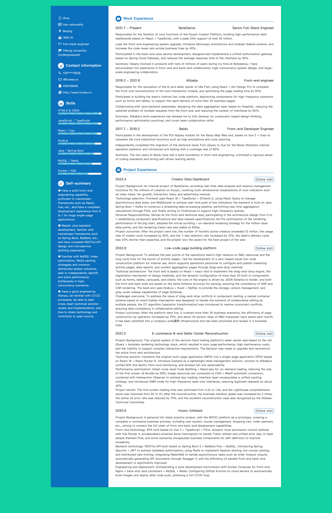

<div align="center">

# resume-auto

[](https://github.com/funlee/resume-auto)
[](https://github.com/funlee/resume-auto/blob/master/package.json)
[](https://webpack.js.org)
[](https://handlebarsjs.com)

[中文](README.zh.md) · English

</div>

### 🦄 Introduction

`resume-auto` is a web-based resume generator built with **Webpack + Handlebars + Less**. It follows a **data-template separation** philosophy: all resume content is managed in a single `resume.json` file, the HTML structure is rendered by Handlebars templates, styles are written in Less, and the final output is a deployable static page.

### ✨ Features

- 📄 **Data-driven**: All resume content (basic info, skills, work experience, projects, etc.) is managed through `resume.json` — no need to touch HTML
- 🎨 **Clean UI**: A two-column layout (blue left, white right) with Font Awesome icons for a professional look
- 📊 **Visual Skill Bars**: Progress bars visually represent proficiency levels for each skill
- 📱 **Responsive Layout**: Grid-based system that adapts to different screen sizes
- ⚡ **Loading Animation**: An elegant loading animation is shown on page initialization
- 🔔 **Tab Title Easter Egg**: The browser tab title dynamically changes when switching away (fun interaction)
- 🔒 **Privacy Protection**: Sensitive info like name and phone number is hidden by default and revealed on hover
- 📦 **Engineering Build**: Based on Webpack 3, supports hot-reload in development and optimized production builds

### 🛠 Tech Stack

| Technology | Version | Purpose |
|---|---|---|
| Webpack | ^3.10.0 | Module bundler |
| Handlebars | ^4.0.11 | HTML template engine |
| Less | ^2.7.2 | CSS preprocessor |
| jQuery | ^3.2.1 | DOM manipulation |
| Font Awesome | ^4.7.0 | Icon library |
| Babel | ^6.26.0 | ES6+ transpiler |
| webpack-dev-server | ^2.9.7 | Development server |

### 📁 Project Structure

```
resume-auto/
├── build/
│   ├── webpack.config.js            # Dev Webpack config
│   └── webpack.production.config.js # Prod Webpack config
├── src/
│   ├── app.js                       # Entry point
│   ├── index.html                   # HTML template
│   ├── data/
│   │   └── resume.json              # ⭐ Resume data config (core)
│   ├── hbs/                         # Handlebars templates
│   │   ├── basic.hbs                # Basic info template
│   │   ├── contact.hbs              # Contact template
│   │   ├── skills.hbs               # Skills template
│   │   ├── advantage.hbs            # Self-summary template
│   │   ├── work.hbs                 # Work experience template
│   │   └── project.hbs              # Project experience template
│   ├── css/
│   │   ├── resume.less              # Main styles
│   │   ├── grid.less                # Grid layout styles
│   │   └── loading.less             # Loading animation styles
│   ├── js/
│   │   └── playTitle.js             # Tab title switch feature
├── package.json
└── favicon.ico
```

### 🚀 Getting Started

**Prerequisites**

- Node.js >= 6.0
- npm >= 3.0

**Installation**

```bash
git clone https://github.com/funlee/resume-auto.git
cd resume-auto
npm install
```

**Development**

```bash
npm start
```

The browser will automatically open at `http://localhost:8080` with hot-reload enabled.

**Production Build**

```bash
npm run build
```

The output will be generated in the `dist/` directory and can be deployed to any static file server.

### ✏️ Customizing Your Resume

Simply edit `src/data/resume.json` to update your resume content.

**resume.json Data Structure**

```json
{
  "title": "Page title",
  "basic": {
    "name": "Display name (can be masked)",
    "reallyName": "Real name (shown on hover)",
    "nation": "Ethnicity",
    "location": "City",
    "birth": "Date of birth",
    "flag": "Job target",
    "education": "School (Degree)"
  },
  "contact": {
    "tel": "Display phone (can be masked)",
    "reallyTel": "Real phone (shown on hover)",
    "email": "Email",
    "qq": "QQ",
    "wechat": "WeChat",
    "website": "Personal website",
    "github": "GitHub profile"
  },
  "skills": [{ "name": "Skill name", "proportion": "Proficiency, e.g. 90%" }],
  "advantage": [{ "text": "Self-advantage description" }],
  "work": [
    {
      "time": "Employment period",
      "company": "Company name",
      "job": "Job title",
      "details": [{ "text": "Job responsibility description" }]
    }
  ],
  "project": [
    {
      "time": "Project date",
      "name": "Project name",
      "linkUrl": "Project URL",
      "linkText": "Link label",
      "details": [{ "text": "Project description" }]
    }
  ]
}
```

### 🖨️ Make Your Own Resume

If you like this resume template, feel free to DIY it and create your own resume:

1. **Customize content**: Go to the `src/data/` folder and edit `resume.json` to fill in your own information

2. **Modify styles**: To change colors, layout, or other visual details, edit `src/css/resume.less`

3. **Export as Image / PDF**: The recommended approach is to use the browser's built-in print dialog (`Ctrl + P` / `Cmd + P`) and choose **Save as PDF** to export directly. Alternatively, you can use a browser's "Export page as image" feature, then edit and crop the image in Photoshop to produce a JPG or PDF file

### 📸 Preview

The resume page uses a classic two-column layout:

- **Left column** (blue background): Basic info, Contact, Skills, Self-summary
- **Right column** (white background): Work experience, Project experience



### 📄 License

[ISC](./package.json) © [funlee](https://github.com/funlee)
