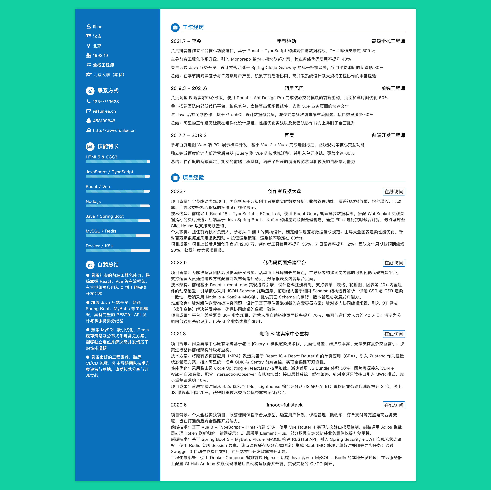

<div align="center">

# resume-auto

[](https://github.com/funlee/resume-auto)
[](https://github.com/funlee/resume-auto/blob/master/package.json)
[](https://webpack.js.org)
[](https://handlebarsjs.com)

中文 · [English](README.md)

</div>

### 🦄 项目简介

`resume-auto` 是一个基于 **Webpack + Handlebars + Less** 构建的 Web 在线简历生成器。项目采用**数据与模板分离**的设计理念：所有简历内容统一维护在一个 `resume.json` 文件中，HTML 结构通过 Handlebars 模板渲染，样式使用 Less 编写，最终打包为可直接部署的静态页面。

### ✨ 功能特性

- 📄 **数据驱动**：所有简历内容（基本信息、技能、工作经历、项目经历等）均通过 `resume.json` 统一管理，无需手动修改 HTML
- 🎨 **精美UI**：左蓝右白的双栏布局，配合 Font Awesome 图标，简洁专业
- 📊 **可视化技能栏**：以进度条形式直观展示各技能的掌握程度
- 📱 **响应式布局**：基于栅格系统，自适应不同屏幕尺寸
- ⚡ **加载动画**：页面初始化时展示优雅的 loading 动画效果
- 🔔 **标签页彩蛋**：切换浏览器标签时，标题会动态变化（趣味交互）
- 🔒 **隐私保护**：支持姓名、电话等敏感信息的悬浮显示（hover 才展示真实信息）
- 📦 **工程化构建**：基于 Webpack 3，支持开发热更新、生产环境打包压缩

### 🛠 技术栈

| 技术 | 版本 | 用途 |
|---|---|---|
| Webpack | ^3.10.0 | 模块打包工具 |
| Handlebars | ^4.0.11 | HTML 模板引擎 |
| Less | ^2.7.2 | CSS 预处理器 |
| jQuery | ^3.2.1 | DOM 操作 |
| Font Awesome | ^4.7.0 | 图标库 |
| Babel | ^6.26.0 | ES6+ 转译 |
| webpack-dev-server | ^2.9.7 | 开发服务器 |

### 📁 项目结构

```
resume-auto/
├── build/
│   ├── webpack.config.js           # 开发环境 Webpack 配置
│   └── webpack.production.config.js # 生产环境 Webpack 配置
├── src/
│   ├── app.js                      # 入口文件
│   ├── index.html                  # HTML 模板
│   ├── data/
│   │   └── resume.json             # ⭐ 简历数据配置文件（核心）
│   ├── hbs/                        # Handlebars 模板
│   │   ├── basic.hbs               # 基本信息模板
│   │   ├── contact.hbs             # 联系方式模板
│   │   ├── skills.hbs              # 技能特长模板
│   │   ├── advantage.hbs           # 自我总结模板
│   │   ├── work.hbs                # 工作经历模板
│   │   └── project.hbs             # 项目经历模板
│   ├── css/
│   │   ├── resume.less             # 主样式
│   │   ├── grid.less               # 栅格布局样式
│   │   └── loading.less            # 加载动画样式
│   ├── js/
│   │   └── playTitle.js            # 标签页标题切换功能
├── package.json
└── favicon.ico
```

### 🚀 快速开始

**环境要求**

- Node.js >= 6.0
- npm >= 3.0

**安装依赖**

```bash
git clone https://github.com/funlee/resume-auto.git
cd resume-auto
npm install
```

**开发模式**

```bash
npm start
```

启动后会自动打开浏览器，访问 `http://localhost:8080`，支持热更新。

**生产构建**

```bash
npm run build
```

构建产物输出到 `dist/` 目录，可直接部署到任意静态服务器。

### ✏️ 如何定制简历

只需编辑 `src/data/resume.json` 文件，即可更新简历内容。

**resume.json 数据结构说明**

```json
{
  "title": "页面标题",
  "basic": {
    "name": "显示名（可脱敏）",
    "reallyName": "真实姓名（hover 后显示）",
    "nation": "民族",
    "location": "所在城市",
    "birth": "出生年月",
    "flag": "求职意向",
    "education": "毕业院校（学历）"
  },
  "contact": {
    "tel": "显示电话（可脱敏）",
    "reallyTel": "真实电话（hover 后显示）",
    "email": "邮箱",
    "qq": "QQ",
    "wechat": "微信",
    "website": "个人网站",
    "github": "GitHub 主页"
  },
  "skills": [{ "name": "技能名称", "proportion": "掌握程度，如 90%" }],
  "advantage": [{ "text": "自我优势描述" }],
  "work": [
    {
      "time": "在职时间",
      "company": "公司名称",
      "job": "职位名称",
      "details": [{ "text": "工作内容描述" }]
    }
  ],
  "project": [
    {
      "time": "项目时间",
      "name": "项目名称",
      "linkUrl": "项目链接",
      "linkText": "链接文字",
      "details": [{ "text": "项目描述" }]
    }
  ]
}
```

### 🖨️ 制作自己的简历

如果你喜欢此简历的模版，可以基于此项目进行 DIY，制作属于自己的简历：

1. **定制内容**：进入 `src/data/` 文件夹，编辑 `resume.json` 中的内容即可定制属于你的简历信息

2. **修改样式**：如需修改配色、布局等，可自行修改样式文件 `src/css/resume.less`

3. **导出为图片 / PDF**：推荐使用浏览器的「打印」功能（`Ctrl + P` / `Cmd + P`），选择「另存为 PDF」直接导出 PDF 格式；也可使用 360 浏览器的「网页导出为图片」功能，再在 Photoshop 中对图片进行裁剪编辑，制作 JPG 或 PDF 格式

### 📸 页面预览

简历页面采用经典双栏布局：

- **左侧栏**（蓝色背景）：基本信息、联系方式、技能特长、自我总结
- **右侧栏**（白色背景）：工作经历、项目经历



### 📄 License

[ISC](./package.json) © [funlee](https://github.com/funlee)
